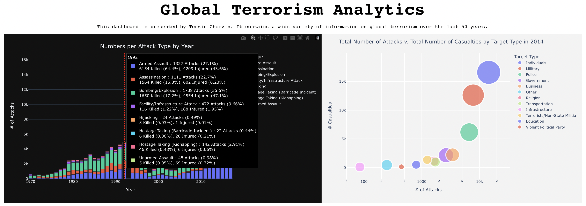

# Global Terrorism Over The Last 50 Years

### Context
The Global Terrorism Database (GTD) is an open-source database including information on terrorist attacks around the world from 1970 through 2017. The GTD includes systematic data on domestic as well as international terrorist incidents that have occurred during this time period and now includes more than 180,000 attacks. The database is maintained by researchers at the National Consortium for the Study of Terrorism and Responses to Terrorism (START), headquartered at the University of Maryland.

### Objective
The main two goals of this analytics project are:
  1. Getting a data-driven understanding of global terrorism from the last five decades
  2. Building new and strengthening existing data visualization skills, with an emphasis on geospatial charts
  
**Note:** The data file is too large to include in this repo. To find it, click [HERE](https://www.kaggle.com/datasets/START-UMD/gtd?datasetId=504&searchQuery=plotly)!

### Analytics Dashboard Preview

