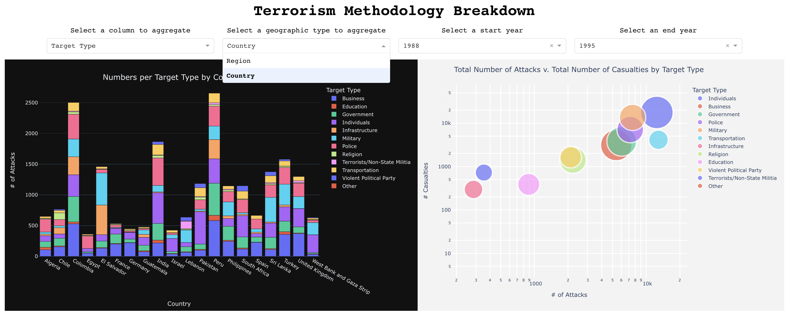
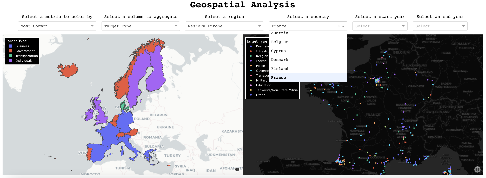
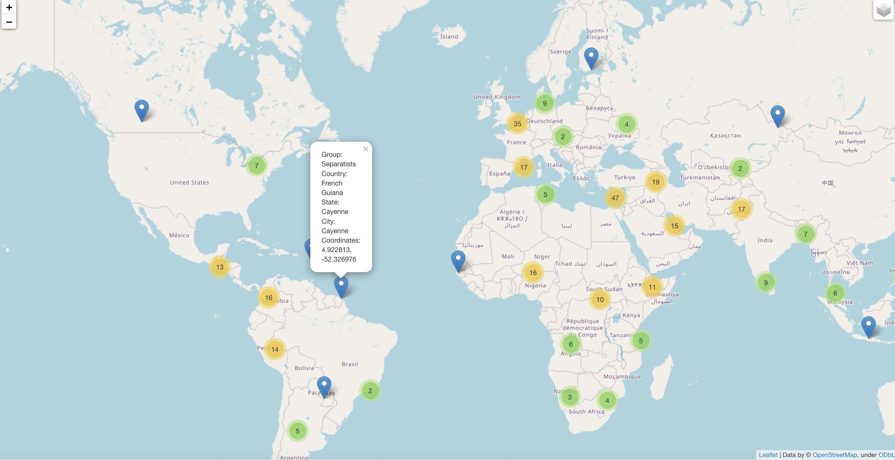

# Global Terrorism Over The Last 50 Years

### Context
The Global Terrorism Database (GTD) is an open-source database including information on terrorist attacks around the world from 1970 through 2017. The GTD includes systematic data on domestic as well as international terrorist incidents that have occurred during this time period and now includes more than 180,000 attacks. The database is maintained by researchers at the National Consortium for the Study of Terrorism and Responses to Terrorism (START), headquartered at the University of Maryland.


### Objective
The main two goals of this analytics project are:
  1. Getting a data-driven understanding of global terrorism from the last five decades
  2. Building new and strengthening existing data visualization skills, with an emphasis on geospatial charts

**To see the full notebook in action, since it doesn't render within the repo, click [HERE](https://nbviewer.org/github/tenzin-choezin/global-terrorism/blob/main/analysis.ipynb)!**
  
### Analytics Dashboard Preview






## Usage
### Install Dependencies

```shell
import numpy as np  
import pandas as pd 
import warnings
import plotly.express as px
import numpy as np
import plotly.graph_objects as go
import geopandas as gpd
import json
import dash
from dash import Dash, dcc, html, Input, Output, dash_table, State
```

You probably want to install them with `pip` or `conda`.


### Getting the data
The main dataset is too large to include in this repo. To find it, click [HERE](https://www.kaggle.com/datasets/START-UMD/gtd?datasetId=504&searchQuery=plotly) to download and upload to your own workspace! For the geospatial data files used, click [here](https://github.com/tenzin-choezin/global-terrorism/tree/main/data). It's stoerd in the **data** folder in this repo.

### Running the application
```shell
python dashboard.py
```

-----------------
<p align="left">
    
    
    
    
    
     
    
</p>

### Technologies used
* Python libraries - numpy, pandas, plotly, dash, geopandas, folium
* Version control - git 

### Tools and Services : 
* IDE - Vs code, Jupyter Lab
* Application deployment - Local server
* Code repository - GitHub
-----------------
